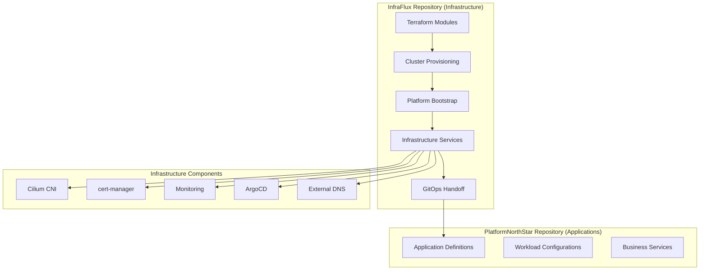

# InfraFlux Architecture

## Vision: Pure Infrastructure Platform

InfraFlux is a **pure infrastructure platform** that provides the foundation for a multi-cluster Kubernetes operating system. It focuses exclusively on infrastructure provisioning, platform services, and GitOps handoff to application repositories.

## Core Principles

1. **Infrastructure as Code**: Everything defined declaratively
2. **GitOps Native**: All changes flow through Git
3. **Multi-Environment**: dev/staging/prod with consistent patterns
4. **Multi-Cluster**: Support for multiple clusters per environment
5. **Configuration Driven**: Easily configurable and changeable
6. **Clean Separation**: Infrastructure vs Application concerns

## Architecture Overview



## Repository Responsibilities

### InfraFlux (This Repository)

- **Terraform Infrastructure**: VM provisioning, networking, storage
- **Kubernetes Clusters**: Creation, configuration, lifecycle management
- **Platform Services**: Cilium, cert-manager, monitoring, DNS
- **GitOps Platform**: ArgoCD setup and configuration
- **Multi-Environment**: Environment-specific infrastructure configs
- **Security**: Platform-level RBAC, network policies, secrets

### PlatformNorthStar (Application Repository)

- **Application Workloads**: Business applications and services
- **Application GitOps**: ArgoCD applications for workloads
- **Service Configurations**: Application-specific configurations
- **Application Secrets**: Workload-specific secrets management
- **Deployment Patterns**: Application deployment strategies

## Directory Structure

```text
infraflux/
├── config/
│   ├── environments/           # Environment-specific configurations
│   │   ├── dev.yaml
│   │   ├── staging.yaml
│   │   └── prod.yaml
│   ├── clusters/               # Cluster-specific configurations
│   │   ├── management.yaml
│   │   ├── workload.yaml
│   │   └── edge.yaml
│   └── defaults/               # Default values and templates
│       ├── cluster.yaml
│       ├── networking.yaml
│       └── security.yaml
├── terraform/
│   ├── modules/                # Reusable Terraform modules
│   │   ├── proxmox-vm/
│   │   ├── talos-cluster/
│   │   ├── networking/
│   │   └── storage/
│   ├── environments/           # Environment-specific deployments
│   │   ├── dev/
│   │   ├── staging/
│   │   └── prod/
│   └── globals/                # Global resources and configs
├── platform/
│   ├── bootstrap/              # Initial cluster bootstrap
│   │   ├── argocd/
│   │   └── cluster-api/
│   ├── infrastructure/         # Platform infrastructure services
│   │   ├── cilium/
│   │   ├── cert-manager/
│   │   ├── monitoring/
│   │   ├── external-dns/
│   │   └── security/
│   └── gitops/                 # GitOps configurations
│       ├── app-of-apps.yaml
│       ├── projects/
│       └── repositories/
├── clusters/
│   ├── templates/              # Cluster size templates
│   │   ├── small.yaml
│   │   ├── medium.yaml
│   │   └── large.yaml
│   ├── base/                   # Base cluster configurations
│   └── overlays/               # Environment-specific overlays
├── scripts/
│   ├── deploy.sh               # Infrastructure deployment
│   ├── bootstrap.sh            # Cluster bootstrap
│   └── manage.sh               # Cluster management utilities
└── docs/
    ├── quick-start.md
    ├── configuration.md
    └── troubleshooting.md
```

## Configuration Philosophy

### Hierarchical Configuration

Configurations follow a hierarchy from general to specific:

1. **Defaults**: Base configurations and templates
2. **Environment**: Environment-specific overrides (dev/staging/prod)
3. **Cluster**: Cluster-specific configurations
4. **Workload**: Workload-specific settings (handled by PlatformNorthStar)

### Configuration Sources

- **YAML Files**: Primary configuration format
- **Environment Variables**: Runtime configurations
- **Secrets**: SOPS-encrypted sensitive data
- **Templates**: Reusable configuration patterns

## Multi-Environment Strategy

### Environment Isolation

- **Complete Separation**: No shared resources between environments
- **Consistent Patterns**: Same infrastructure patterns across environments
- **Independent Lifecycles**: Each environment can be managed independently
- **Configuration Driven**: Differences expressed through configuration

### Environment Progression

```
Development → Staging → Production
```

Changes flow through environments with appropriate testing and validation at each stage.

## GitOps Handoff Pattern

### Infrastructure Platform Readiness

InfraFlux provides a "ready" signal when:

1. Kubernetes cluster is operational
2. Platform services are healthy (Cilium, cert-manager, etc.)
3. ArgoCD is deployed and configured
4. Repository access is configured
5. RBAC and security policies are in place

### Application Repository Integration

ArgoCD in the infrastructure cluster is configured to:

1. Watch PlatformNorthStar repository
2. Deploy applications to appropriate namespaces
3. Enforce platform-defined policies
4. Provide observability and monitoring

### Handoff Mechanism

```yaml
# ArgoCD Application pointing to PlatformNorthStar
apiVersion: argoproj.io/v1alpha1
kind: Application
metadata:
  name: platform-applications
  namespace: argocd
spec:
  project: applications
  source:
    repoURL: https://github.com/binGhzal/PlatformNorthStar
    targetRevision: main
    path: environments/{{ .Values.environment }}
  destination:
    server: https://kubernetes.default.svc
  syncPolicy:
    automated:
      prune: true
      selfHeal: true
```

## Security Model

### Platform Security

- **Network Policies**: Cilium-based micro-segmentation
- **RBAC**: Kubernetes role-based access control
- **Pod Security**: Pod security standards enforcement
- **Secret Management**: SOPS encryption for platform secrets

### Application Security

- **Namespace Isolation**: Applications deployed to dedicated namespaces
- **Service Mesh**: Optional service mesh for application communication
- **Application RBAC**: Application-specific access controls
- **Application Secrets**: Application-managed secret encryption

## Monitoring and Observability

### Infrastructure Monitoring

- **Cluster Health**: Node, pod, and service health
- **Platform Services**: Service availability and performance
- **Resource Utilization**: CPU, memory, storage, network
- **Security Events**: Policy violations and security incidents

### Application Monitoring

- **Application Metrics**: Business and technical metrics
- **Distributed Tracing**: Request flow across services
- **Log Aggregation**: Centralized logging for applications
- **Alerting**: Application-specific alerting rules

## Disaster Recovery

### Infrastructure Recovery

- **Cluster Rebuild**: Ability to recreate clusters from configuration
- **Data Backup**: Platform data backup and restoration
- **Configuration Backup**: Git-based configuration versioning
- **Automated Recovery**: Scripted recovery procedures

### Application Recovery

- **Application Data**: Application-specific backup strategies
- **State Management**: Stateful application recovery
- **Cross-Region**: Multi-region deployment capabilities
- **Testing**: Regular disaster recovery testing

## Performance and Scaling

### Horizontal Scaling

- **Cluster Scaling**: Add/remove nodes based on demand
- **Multi-Cluster**: Scale across multiple clusters
- **Cross-Environment**: Promote workloads across environments
- **Auto-Scaling**: Kubernetes-native autoscaling

### Vertical Scaling

- **Resource Allocation**: Adjust resource allocations
- **Performance Tuning**: Platform and application optimization
- **Capacity Planning**: Predictive capacity management
- **Right-Sizing**: Optimal resource utilization

## Development Workflow

### Infrastructure Changes

1. Update configuration files
2. Test in development environment
3. Promote through staging
4. Deploy to production
5. Monitor and validate

### Platform Service Updates

1. Update service configurations
2. Test with canary deployments
3. Progressive rollout
4. Automated rollback on issues

### Multi-Environment Promotion

```
Developer → Dev Environment → Staging Environment → Production Environment
    ↓             ↓                    ↓                     ↓
  Local Test → Integration Test → User Acceptance → Production
```

## Integration Points

### External Systems

- **DNS Providers**: External DNS management
- **Certificate Authorities**: TLS certificate provisioning
- **Storage Systems**: Persistent volume provisioning
- **Monitoring Systems**: External monitoring integration

### Application Repository

- **Git Integration**: Automated synchronization
- **Policy Enforcement**: Platform policy validation
- **Resource Quotas**: Application resource limits
- **Security Scanning**: Container and code scanning

This architecture provides a solid foundation for a multi-cluster Kubernetes operating system while maintaining clear separation of concerns between infrastructure and applications.
