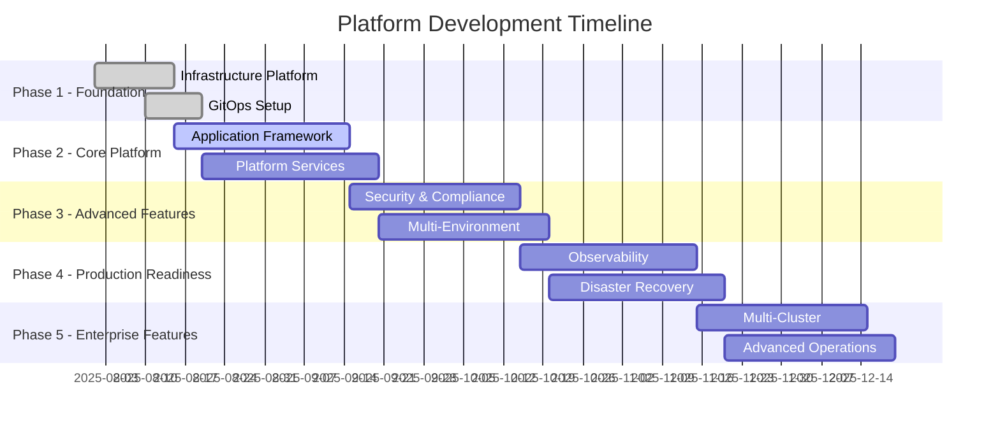

# 🚀 Comprehensive Development Roadmap

## InfraFlux + PlatformNorthStar Platform Development

**Version**: 1.0
**Created**: August 2025
**Target Completion**: Q4 2025

---

## 📊 Executive Summary

This roadmap outlines the complete development journey for transforming InfraFlux and PlatformNorthStar into a production-grade, enterprise-ready Kubernetes platform. The project focuses on creating a robust, scalable, and maintainable infrastructure platform with comprehensive application deployment capabilities.

### Key Objectives

- **Infrastructure Excellence**: Production-ready Kubernetes platform with enterprise security
- **Developer Experience**: Streamlined application deployment and management
- **Operational Maturity**: Full observability, automation, and disaster recovery
- **Security & Compliance**: Enterprise-grade security posture and compliance readiness
- **Scalability**: Support for multi-cluster, multi-region deployments

---

## 🗺️ Roadmap Overview



---

## 📈 Current State Assessment

### ✅ Completed (Phase 1)

- **InfraFlux Foundation**: Repository restructuring, configuration system, Terraform modules
- **GitOps Setup**: ArgoCD app-of-apps pattern, repository integration
- **Basic Infrastructure**: Cilium, cert-manager, monitoring, external-dns, longhorn
- **Deployment Automation**: Scripts for infrastructure and platform deployment

### 🚧 In Progress

- **PlatformNorthStar**: Basic structure exists, needs full application framework
- **Documentation**: Partial documentation, needs comprehensive guides
- **Testing**: Basic validation, needs comprehensive test suite

### ⏳ Pending

- **Production Security**: Hardened configurations, RBAC, network policies
- **Advanced Monitoring**: SLI/SLO, advanced dashboards, ML-driven alerts
- **Disaster Recovery**: Backup/restore, business continuity
- **Multi-cluster**: Federation, workload distribution, cross-cluster networking

---

## 🎯 Phase 1: Foundation Complete ✅

**Duration**: August 1-15, 2025 (**DONE**)

### Infrastructure Platform ✅

- [x] Repository restructuring and clean separation
- [x] Hierarchical configuration system
- [x] Terraform infrastructure modules
- [x] Multi-environment support (dev/staging/prod)
- [x] Basic platform services deployment
- [x] GitOps integration with ArgoCD

### Key Deliverables ✅

- [x] Clean repository structure (53 files, 30 directories)
- [x] Terraform modules for Proxmox + Talos
- [x] Configuration system with environment overrides
- [x] Deployment scripts (`deploy.sh`, `platform-manager.sh`)
- [x] Basic platform services (Cilium, cert-manager, monitoring, etc.)

---

## 🔧 Phase 2: Core Platform Development

**Duration**: August 15 - September 20, 2025 (**4-5 weeks**)

### 2.1 Application Framework (Week 1-2)

#### PlatformNorthStar Enhancement

```yaml
Priority: HIGH
Effort: 3 weeks
Dependencies: InfraFlux platform ready
```

**Tasks:**

- [ ] **Complete Application Structure**

  - [ ] Create comprehensive application templates
  - [ ] Implement Helm chart library for common patterns
  - [ ] Build application catalog with web-services, APIs, databases
  - [ ] Create deployment scripts and automation

- [ ] **Application Categories Implementation**

  ```
  applications/
  ├── web-services/          # Frontend applications, SPAs
  ├── apis/                  # REST/GraphQL services
  ├── databases/             # PostgreSQL, Redis, ClickHouse
  ├── background-jobs/       # Scheduled tasks, processors
  └── infrastructure-apps/   # Monitoring agents, loggers
  ```

- [ ] **Helm Chart Templates**

  ```
  charts/
  ├── app-template/          # Generic application template
  ├── database-template/     # Database deployment template
  ├── api-template/          # API service template
  └── web-template/          # Web application template
  ```

- [ ] **Environment-Specific Configurations**
  - [ ] Complete dev environment configurations
  - [ ] Build staging environment setup
  - [ ] Create production environment templates
  - [ ] Implement configuration validation

#### Deliverables:

- [ ] Complete application framework with 4+ application categories
- [ ] Reusable Helm chart library (4+ templates)
- [ ] Working dev environment with sample applications
- [ ] Application deployment automation scripts

### 2.2 Enhanced Platform Services (Week 2-3)

#### Advanced Platform Components

```yaml
Priority: HIGH
Effort: 2 weeks
Dependencies: Basic platform services
```

**Tasks:**

- [ ] **Advanced Networking**

  - [ ] Cilium service mesh configuration
  - [ ] Network policies for micro-segmentation
  - [ ] Ingress controller optimization
  - [ ] Service discovery enhancements

- [ ] **Enhanced Storage**

  - [ ] Longhorn backup automation
  - [ ] Storage classes optimization
  - [ ] Volume snapshot policies
  - [ ] Data lifecycle management

- [ ] **Certificate Management**

  - [ ] Production certificate issuers
  - [ ] Automated certificate rotation
  - [ ] Wild-card certificate support
  - [ ] Certificate monitoring and alerting

- [ ] **DNS Automation**
  - [ ] Multi-provider DNS support
  - [ ] Health-check integration
  - [ ] Geo-routing capabilities
  - [ ] DNS-based service discovery

#### Deliverables:

- [ ] Production-ready networking with service mesh
- [ ] Automated storage management and backup
- [ ] Complete certificate automation
- [ ] Advanced DNS management

### 2.3 Platform Integration (Week 3-4)

#### GitOps Enhancement

```yaml
Priority: MEDIUM
Effort: 1 week
Dependencies: Application framework
```

**Tasks:**

- [ ] **Advanced ArgoCD Configuration**

  - [ ] Application sets for automated discovery
  - [ ] Progressive deployment strategies
  - [ ] Rollback automation
  - [ ] Health check integration

- [ ] **Configuration Management**
  - [ ] Advanced configuration validation
  - [ ] Configuration drift detection
  - [ ] Automated configuration updates
  - [ ] Configuration versioning

#### Deliverables:

- [ ] Advanced GitOps workflows
- [ ] Automated application discovery
- [ ] Configuration management system

---

## 🔐 Phase 3: Security & Compliance

**Duration**: September 15 - October 20, 2025 (**5 weeks**)

### 3.1 Security Hardening (Week 1-2)

#### Platform Security

```yaml
Priority: CRITICAL
Effort: 2 weeks
Dependencies: Core platform
```

**Tasks:**

- [ ] **Container Security**

  - [ ] Image vulnerability scanning with Trivy
  - [ ] Runtime security with Tetragon
  - [ ] Container runtime policies
  - [ ] Image signing and verification

- [ ] **Network Security**

  - [ ] Zero-trust network policies
  - [ ] Service mesh mTLS
  - [ ] Ingress security hardening
  - [ ] Firewall rule automation

- [ ] **Access Control**

  - [ ] Enhanced RBAC implementation
  - [ ] Service account management
  - [ ] API security policies
  - [ ] Audit logging configuration

- [ ] **Secret Management**
  - [ ] External Secrets Operator integration
  - [ ] HashiCorp Vault integration
  - [ ] Secret rotation automation
  - [ ] Secret scanning and monitoring

#### Deliverables:

- [ ] Container security scanning and policies
- [ ] Zero-trust network implementation
- [ ] Enhanced RBAC and access controls
- [ ] Automated secret management

### 3.2 Compliance Framework (Week 2-3)

#### Regulatory Compliance

```yaml
Priority: HIGH
Effort: 2 weeks
Dependencies: Security hardening
```

**Tasks:**

- [ ] **Compliance Monitoring**

  - [ ] CIS Kubernetes Benchmark compliance
  - [ ] NIST framework alignment
  - [ ] SOC 2 preparation
  - [ ] GDPR data protection measures

- [ ] **Policy Enforcement**

  - [ ] OPA Gatekeeper policies
  - [ ] Admission controller implementation
  - [ ] Compliance scanning automation
  - [ ] Policy violation alerting

- [ ] **Audit and Reporting**
  - [ ] Comprehensive audit logging
  - [ ] Compliance reporting automation
  - [ ] Security metrics dashboard
  - [ ] Incident response procedures

#### Deliverables:

- [ ] Compliance monitoring framework
- [ ] Automated policy enforcement
- [ ] Audit and reporting system

### 3.3 Multi-Environment Security (Week 3-5)

#### Environment-Specific Security

```yaml
Priority: HIGH
Effort: 2 weeks
Dependencies: Compliance framework
```

**Tasks:**

- [ ] **Development Security**

  - [ ] Relaxed but secure development policies
  - [ ] Developer access controls
  - [ ] Testing environment isolation
  - [ ] Security training integration

- [ ] **Staging Security**

  - [ ] Production-like security posture
  - [ ] Security testing automation
  - [ ] Penetration testing integration
  - [ ] Security validation gates

- [ ] **Production Security**
  - [ ] Maximum security hardening
  - [ ] Zero-trust implementation
  - [ ] Continuous security monitoring
  - [ ] Incident response automation

#### Deliverables:

- [ ] Environment-specific security configurations
- [ ] Security testing automation
- [ ] Production security hardening

---

## 📊 Phase 4: Observability & Operations

**Duration**: October 15 - November 20, 2025 (**5 weeks**)

### 4.1 Advanced Monitoring (Week 1-2)

#### Observability Platform

```yaml
Priority: HIGH
Effort: 2 weeks
Dependencies: Core platform
```

**Tasks:**

- [ ] **Metrics Enhancement**

  - [ ] Custom application metrics
  - [ ] Business KPI monitoring
  - [ ] SLI/SLO implementation
  - [ ] Capacity planning metrics

- [ ] **Distributed Tracing**

  - [ ] Jaeger deployment and configuration
  - [ ] Application instrumentation
  - [ ] Performance bottleneck analysis
  - [ ] Dependency mapping

- [ ] **Advanced Logging**

  - [ ] Structured logging standards
  - [ ] Log aggregation optimization
  - [ ] Log-based alerting
  - [ ] Log retention policies

- [ ] **Alerting Intelligence**
  - [ ] ML-driven anomaly detection
  - [ ] Alert correlation and reduction
  - [ ] Escalation policies
  - [ ] On-call management integration

#### Deliverables:

- [ ] Advanced monitoring stack with SLI/SLO
- [ ] Distributed tracing implementation
- [ ] Intelligent alerting system
- [ ] Comprehensive logging platform

### 4.2 Performance Optimization (Week 2-3)

#### Platform Performance

```yaml
Priority: MEDIUM
Effort: 2 weeks
Dependencies: Advanced monitoring
```

**Tasks:**

- [ ] **Resource Optimization**

  - [ ] Vertical Pod Autoscaler (VPA)
  - [ ] Cluster autoscaling optimization
  - [ ] Resource quotas and limits tuning
  - [ ] Cost optimization implementation

- [ ] **Application Performance**

  - [ ] Application profiling tools
  - [ ] Performance testing automation
  - [ ] Cache optimization strategies
  - [ ] Database performance tuning

- [ ] **Network Optimization**
  - [ ] Service mesh performance tuning
  - [ ] Load balancer optimization
  - [ ] CDN integration
  - [ ] Network latency reduction

#### Deliverables:

- [ ] Automated resource optimization
- [ ] Performance testing framework
- [ ] Network optimization implementation

### 4.3 Disaster Recovery (Week 3-5)

#### Business Continuity

```yaml
Priority: CRITICAL
Effort: 2 weeks
Dependencies: Advanced monitoring
```

**Tasks:**

- [ ] **Backup Strategy**

  - [ ] Velero backup automation
  - [ ] Database backup strategies
  - [ ] Configuration backup
  - [ ] Cross-region backup replication

- [ ] **Disaster Recovery**

  - [ ] RTO/RPO target definition
  - [ ] DR testing automation
  - [ ] Failover procedures
  - [ ] Recovery validation

- [ ] **High Availability**

  - [ ] Multi-AZ deployment
  - [ ] Database clustering
  - [ ] Application redundancy
  - [ ] Network failover

- [ ] **Chaos Engineering**
  - [ ] Chaos Monkey implementation
  - [ ] Failure injection testing
  - [ ] Resilience validation
  - [ ] Recovery time optimization

#### Deliverables:

- [ ] Automated backup and recovery system
- [ ] Disaster recovery procedures
- [ ] High availability implementation
- [ ] Chaos engineering framework

---

## 🌐 Phase 5: Enterprise Features

**Duration**: November 15 - December 20, 2025 (**5 weeks**)

### 5.1 Multi-Cluster Management (Week 1-3)

#### Cluster Federation

```yaml
Priority: HIGH
Effort: 3 weeks
Dependencies: Single cluster maturity
```

**Tasks:**

- [ ] **Cluster Management**

  - [ ] Cluster API (CAPI) implementation
  - [ ] Multi-cluster ArgoCD setup
  - [ ] Cluster lifecycle automation
  - [ ] Cross-cluster networking

- [ ] **Workload Distribution**

  - [ ] Multi-cluster scheduling
  - [ ] Workload placement policies
  - [ ] Resource federation
  - [ ] Cross-cluster service discovery

- [ ] **Data Replication**

  - [ ] Database replication strategies
  - [ ] Configuration synchronization
  - [ ] Secret distribution
  - [ ] Backup coordination

- [ ] **Regional Deployment**
  - [ ] Multi-region infrastructure
  - [ ] Geo-distributed applications
  - [ ] Latency optimization
  - [ ] Compliance boundary management

#### Deliverables:

- [ ] Multi-cluster management platform
- [ ] Automated workload distribution
- [ ] Cross-cluster networking
- [ ] Regional deployment capabilities

### 5.2 Advanced Operations (Week 3-4)

#### Operational Excellence

```yaml
Priority: MEDIUM
Effort: 2 weeks
Dependencies: Multi-cluster setup
```

**Tasks:**

- [ ] **Automation Framework**

  - [ ] Infrastructure automation
  - [ ] Application lifecycle automation
  - [ ] Self-healing capabilities
  - [ ] Predictive maintenance

- [ ] **Cost Management**

  - [ ] Resource cost tracking
  - [ ] Cost optimization recommendations
  - [ ] Budget alerts and controls
  - [ ] Chargeback implementation

- [ ] **Governance**
  - [ ] Resource quotas and policies
  - [ ] Compliance automation
  - [ ] Change management
  - [ ] Approval workflows

#### Deliverables:

- [ ] Comprehensive automation framework
- [ ] Cost management system
- [ ] Governance and compliance automation

### 5.3 Platform as a Service (Week 4-5)

#### Developer Platform

```yaml
Priority: HIGH
Effort: 2 weeks
Dependencies: Advanced operations
```

**Tasks:**

- [ ] **Developer Experience**

  - [ ] Self-service application deployment
  - [ ] Developer portal implementation
  - [ ] Documentation automation
  - [ ] Developer tools integration

- [ ] **API Management**

  - [ ] API gateway implementation
  - [ ] API lifecycle management
  - [ ] Rate limiting and quotas
  - [ ] API analytics and monitoring

- [ ] **Integration Platform**
  - [ ] Event-driven architecture
  - [ ] Message queue implementation
  - [ ] Workflow orchestration
  - [ ] External system integration

#### Deliverables:

- [ ] Developer self-service platform
- [ ] API management platform
- [ ] Integration and workflow system

---

## 📋 Detailed Task Breakdown

### Current Sprint (Phase 2 - Week 1)

**Focus**: Application Framework Development

#### Immediate Tasks (This Week):

1. **Create Application Templates** (2 days)

   - Build generic application Helm chart
   - Create database deployment template
   - Implement API service template
   - Design web application template

2. **Implement Application Categories** (2 days)

   - Set up web-services directory structure
   - Create APIs application framework
   - Build databases deployment system
   - Implement background-jobs framework

3. **Environment Configuration** (1 day)
   - Complete dev environment setup
   - Create staging environment templates
   - Build production environment framework

#### Next Week Tasks:

1. **Advanced Platform Services** (3 days)

   - Cilium service mesh configuration
   - Enhanced storage management
   - Certificate automation
   - DNS management improvements

2. **GitOps Enhancement** (2 days)
   - ArgoCD application sets
   - Progressive deployment strategies
   - Configuration management improvements

---

## 🎯 Success Metrics & KPIs

### Technical Metrics

- **Infrastructure Reliability**: 99.9% uptime SLA
- **Deployment Frequency**: Daily deployments to dev, weekly to prod
- **Lead Time**: &lt;4 hours from commit to production
- **Mean Time to Recovery**: &lt;30 minutes
- **Security Compliance**: 100% policy compliance
- **Cost Efficiency**: 20% infrastructure cost reduction

### Business Metrics

- **Developer Productivity**: 50% faster application deployment
- **Time to Market**: 40% reduction in feature delivery time
- **Platform Adoption**: 90% team adoption rate
- **Self-Service Ratio**: 80% developer self-service
- **Support Tickets**: 60% reduction in infrastructure issues

### Operational Metrics

- **Automation Level**: 95% process automation
- **Documentation Coverage**: 100% API and process documentation
- **Training Completion**: 100% team certification
- **Incident Response**: &lt;15 minutes detection, &lt;30 minutes resolution

---

## 🚧 Risk Assessment & Mitigation

### High-Risk Items

1. **Multi-Cluster Complexity**

   - **Risk**: Network complexity and debugging challenges
   - **Mitigation**: Gradual rollout, comprehensive testing, expert consultation

2. **Security Implementation**

   - **Risk**: Security gaps during rapid development
   - **Mitigation**: Security-first approach, regular audits, automated scanning

3. **Performance at Scale**
   - **Risk**: Performance degradation under load
   - **Mitigation**: Performance testing, gradual scaling, monitoring

### Medium-Risk Items

1. **Team Learning Curve**

   - **Risk**: Adoption delays due to complexity
   - **Mitigation**: Comprehensive training, documentation, mentoring

2. **Third-Party Dependencies**
   - **Risk**: Vendor lock-in or service limitations
   - **Mitigation**: Open-source first, multi-vendor strategy

---

## 💡 Dependencies & Prerequisites

### Infrastructure Dependencies

- **Proxmox Cluster**: Minimum 3 nodes for HA
- **Network Infrastructure**: VLAN support, sufficient bandwidth
- **Storage**: High-performance storage for databases
- **DNS**: Authoritative DNS control for automation

### Team Dependencies

- **Kubernetes Expertise**: Advanced K8s knowledge required
- **Security Knowledge**: Security best practices understanding
- **DevOps Skills**: GitOps and automation experience
- **Application Development**: Modern application patterns

### Tool Dependencies

- **Terraform/OpenTofu**: Infrastructure provisioning
- **ArgoCD**: GitOps deployment
- **Helm**: Application packaging
- **Monitoring Stack**: Prometheus, Grafana, AlertManager

---

## 📚 Resources & Learning

### Training Requirements

1. **Kubernetes Advanced Concepts** (All team members)
2. **GitOps with ArgoCD** (Operations team)
3. **Security Best Practices** (Security team)
4. **Terraform Advanced** (Infrastructure team)
5. **Observability Platform** (SRE team)

### Documentation Deliverables

- [ ] **Architecture Decision Records (ADRs)**
- [ ] **Runbooks and Procedures**
- [ ] **API Documentation**
- [ ] **Security Playbooks**
- [ ] **Disaster Recovery Procedures**
- [ ] **Developer Onboarding Guide**

### Community Resources

- **CNCF Projects**: Leverage cloud-native ecosystem
- **Industry Best Practices**: Follow proven patterns
- **Open Source Contributions**: Contribute back to community
- **Conference Participation**: Stay current with trends

---

## 🎉 Expected Outcomes

### End of Q4 2025 Deliverables

#### Infrastructure Platform

- **Production-Ready Multi-Cluster Platform**: Fully automated, secure, observable
- **Self-Service Developer Platform**: Complete developer experience
- **Enterprise Security Posture**: Compliance-ready, zero-trust implementation
- **Advanced Operations**: Full automation, intelligent monitoring, disaster recovery

#### Application Platform

- **Comprehensive Application Framework**: Support for all application types
- **Multi-Environment Deployment**: Seamless dev→staging→prod pipeline
- **Advanced GitOps**: Intelligent deployments, automated rollbacks
- **Developer Tools**: Self-service capabilities, integrated workflows

#### Business Value

- **Accelerated Development**: 50% faster time-to-market
- **Improved Reliability**: 99.9% platform availability
- **Enhanced Security**: Enterprise-grade security posture
- **Cost Optimization**: 20% infrastructure cost reduction
- **Team Productivity**: 40% improvement in developer velocity

---

## 📞 Contact & Governance

### Project Leadership

- **Platform Owner**: Infrastructure Team Lead
- **Security Champion**: Security Team Lead
- **Developer Advocate**: Development Team Lead

### Review Cadence

- **Weekly Sprint Reviews**: Progress and blockers
- **Monthly Steering Committee**: Strategic decisions
- **Quarterly Business Reviews**: ROI and business alignment

### Decision Making

- **Technical Decisions**: Architecture review board
- **Security Decisions**: Security team approval
- **Business Decisions**: Steering committee consensus

---

**This roadmap represents a comprehensive path to building a world-class Kubernetes platform that will serve as the foundation for modern application development and deployment. Success depends on disciplined execution, continuous learning, and unwavering focus on developer experience and operational excellence.**

---

_Last Updated: August 13, 2025_
_Next Review: August 20, 2025_
_Version: 1.0_
