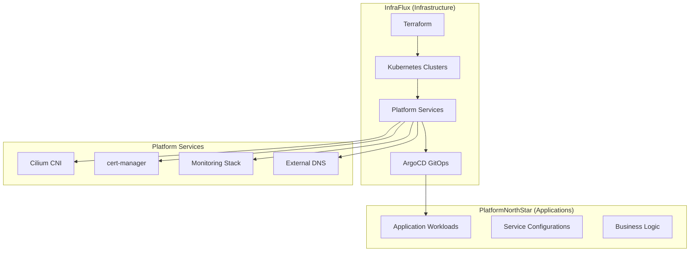

# InfraFlux

A pure infrastructure platform for multi-cluster Kubernetes environments using Talos, Cluster API, and GitOps. InfraFlux provides the foundational infrastructure that enables application teams to deploy workloads through the companion [PlatformNorthStar](https://github.com/binGhzal/PlatformNorthStar) repository.

## 🎯 Mission

**Provide reliable, scalable, and secure Kubernetes infrastructure that application teams can consume without worrying about platform complexity.**

## 🏗️ What InfraFlux Provides

- **🖥️ Infrastructure Provisioning**: Terraform-based VM and cluster provisioning
- **⚙️ Kubernetes Clusters**: Multi-environment cluster management (dev/staging/prod)
- **🌐 Platform Services**: Cilium CNI, cert-manager, monitoring, external DNS
- **🔄 GitOps Platform**: ArgoCD setup for infrastructure and application deployment
- **🔒 Security Foundation**: RBAC, network policies, pod security standards
- **📊 Observability**: Infrastructure monitoring, logging, and alerting
- **🎛️ Configuration Management**: Hierarchical, environment-aware configuration

## 🚀 What PlatformNorthStar Consumes

InfraFlux hands off to [PlatformNorthStar](https://github.com/binGhzal/PlatformNorthStar) for:

- Application workloads and services
- Business logic deployment
- Application-specific configurations
- Workload monitoring and observability

## ⚡ Quick Start

### 1. Deploy Development Environment

```bash
# Clone the repository
git clone https://github.com/binGhzal/infraflux.git
cd infraflux

# Deploy development infrastructure
./scripts/deploy.sh -e dev
```

This command will:

- ✅ Provision VMs with Terraform
- ✅ Bootstrap Talos Kubernetes cluster
- ✅ Deploy platform services (Cilium, cert-manager, monitoring)
- ✅ Configure ArgoCD for GitOps
- ✅ Set up integration with PlatformNorthStar

### 2. Access Your Platform

```bash
# Set up kubectl access
export KUBECONFIG=$(pwd)/kubeconfig

# Check cluster status
kubectl get nodes

# Check platform services
kubectl get applications -n argocd

# Access ArgoCD UI
kubectl -n argocd get secret argocd-initial-admin-secret -o jsonpath="{.data.password}" | base64 -d
```

### 3. Deploy Applications

Applications are deployed via the [PlatformNorthStar](https://github.com/binGhzal/PlatformNorthStar) repository, which ArgoCD automatically monitors and deploys.

## 🛠️ Configuration

### Everything is Configurable

InfraFlux uses a hierarchical configuration system:

```text
config/
├── defaults/           # Base configurations
│   └── infrastructure.yaml
├── environments/       # Environment-specific overrides
│   ├── dev.yaml       # Development settings
│   ├── staging.yaml   # Staging settings
│   └── prod.yaml      # Production settings
└── clusters/          # Cluster-specific configs
```

### Easy Environment Deployment

```bash
# Development (small, relaxed security)
./scripts/deploy.sh -e dev

# Staging (production-like testing)
./scripts/deploy.sh -e staging

# Production (HA, security hardened)
./scripts/deploy.sh -e prod

# Custom configuration
./scripts/deploy.sh -e prod -c /path/to/custom.yaml

# Dry run (see what would be deployed)
./scripts/deploy.sh -e prod --dry-run
```

## 🔧 Architecture



## 📁 Directory Structure

```text
infraflux/
├── config/                    # Configuration management
│   ├── defaults/              # Default values
│   ├── environments/          # Environment-specific configs
│   └── clusters/              # Cluster-specific configs
├── terraform/                 # Infrastructure provisioning
│   ├── modules/               # Reusable Terraform modules
│   └── environments/          # Environment-specific deployments
├── platform/                  # Platform service definitions
│   ├── bootstrap/             # Bootstrap configurations
│   ├── infrastructure/        # Infrastructure services
│   └── gitops/                # GitOps configurations
├── clusters/                  # Cluster templates and overlays
├── scripts/                   # Automation scripts
└── docs/                      # Documentation
```

## 🌍 Multi-Environment Support

### Environment Characteristics

| Environment | Purpose                | Cluster Size             | Security | Certificates |
| ----------- | ---------------------- | ------------------------ | -------- | ------------ |
| **dev**     | Development & testing  | Small (1 CP, 2 workers)  | Relaxed  | Staging      |
| **staging** | Pre-production testing | Medium (3 CP, 3 workers) | Standard | Staging      |
| **prod**    | Production workloads   | Large (3 CP, 5+ workers) | Hardened | Production   |

### Configuration Examples

**Development** (`config/environments/dev.yaml`):

```yaml
environment:
  name: "dev"
  domain: "dev.platform.local"

clusterOverrides:
  nodes:
    controlPlane:
      count: 1
      cpu: 2
      memory: "4Gi"
```

**Production** (`config/environments/prod.yaml`):

```yaml
environment:
  name: "prod"
  domain: "platform.company.com"

clusterOverrides:
  nodes:
    controlPlane:
      count: 3
      cpu: 8
      memory: "16Gi"
    worker:
      count: 5
      cpu: 16
      memory: "32Gi"
```

## 🔐 Security & Compliance

- **🛡️ Pod Security Standards**: Enforced at platform level
- **🌐 Network Policies**: Cilium-based micro-segmentation
- **🔑 RBAC**: Kubernetes role-based access control
- **🔒 Secret Management**: SOPS encryption for sensitive data
- **📜 Certificate Management**: Automated TLS with cert-manager

## 📊 Monitoring & Observability

- **📈 Prometheus**: Metrics collection and alerting
- **📊 Grafana**: Visualization and dashboards
- **🔍 Cilium Hubble**: Network observability
- **📝 Centralized Logging**: Infrastructure and application logs
- **🚨 Alerting**: Platform and application alerts

## 🔄 GitOps Integration

### How It Works

1. **InfraFlux** deploys and configures ArgoCD
2. **ArgoCD** monitors both repositories:
   - InfraFlux for platform services
   - PlatformNorthStar for applications
3. **All changes** flow through Git (Infrastructure as Code)
4. **Automatic deployment** with rollback capabilities

### Repository Integration

```yaml
# ArgoCD automatically configures these repositories
repositories:
  - url: https://github.com/binGhzal/infraflux
    name: infraflux (platform services)
  - url: https://github.com/binGhzal/PlatformNorthStar
    name: platform-north-star (applications)
```

## 📚 Documentation

- **[Architecture Guide](ARCHITECTURE.md)**: Detailed architecture overview
- **[Separation Guide](SEPARATION-GUIDE.md)**: Complete separation explanation
- **[Quick Start](docs/quick-start.md)**: Step-by-step deployment
- **[Configuration](docs/configuration.md)**: Configuration management
- **[Troubleshooting](docs/troubleshooting.md)**: Common issues and solutions

## 🤝 Integration with PlatformNorthStar

InfraFlux provides the foundation, PlatformNorthStar provides the applications:

| Repository            | Responsibility          | Technology Focus                                 |
| --------------------- | ----------------------- | ------------------------------------------------ |
| **InfraFlux**         | Infrastructure platform | Terraform, Kubernetes, Platform services         |
| **PlatformNorthStar** | Application workloads   | Helm charts, Application configs, Business logic |

## 🚀 Getting Started

1. **Deploy Infrastructure**: Use InfraFlux to create your platform
2. **Set up Applications**: Use PlatformNorthStar for application deployment
3. **Monitor & Operate**: Use the integrated observability stack
4. **Scale & Evolve**: Add environments and applications as needed

## 🏆 Benefits

- ✅ **Clear Separation**: Infrastructure vs. Application concerns
- ✅ **Easy Configuration**: Hierarchical, environment-aware config
- ✅ **Multi-Environment**: Consistent patterns across dev/staging/prod
- ✅ **GitOps Native**: All changes flow through Git
- ✅ **Security Focused**: Defense in depth security model
- ✅ **Observability First**: Comprehensive monitoring and alerting
- ✅ **Production Ready**: HA, disaster recovery, compliance

## 📞 Support

For infrastructure-related questions, use this repository's issues.
For application deployment questions, use [PlatformNorthStar issues](https://github.com/binGhzal/PlatformNorthStar/issues).

**Ready to build your Kubernetes operating system? Start with `./scripts/deploy.sh -e dev`!**
