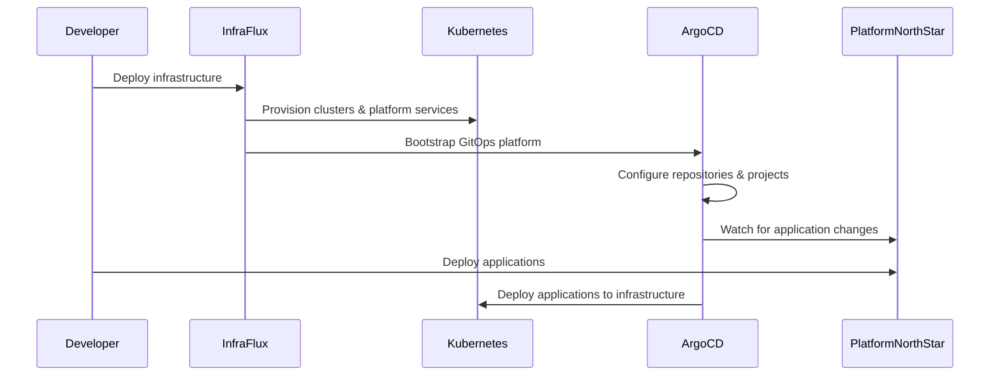

# InfraFlux + PlatformNorthStar: Complete Separation Guide

## Overview

We have successfully restructured your platform into two focused repositories following GitOps and Infrastructure as Code best practices:

- **InfraFlux**: Pure infrastructure platform (this repository)
- **PlatformNorthStar**: Application workloads and services

## Repository Responsibilities

### 🏗️ InfraFlux (Infrastructure Platform)

**Purpose**: Provides the foundational infrastructure for your multi-cluster Kubernetes operating system

**Responsibilities**:
- ✅ Terraform infrastructure provisioning (VMs, networking, storage)
- ✅ Kubernetes cluster creation and lifecycle management
- ✅ Platform services (Cilium, cert-manager, monitoring, DNS)
- ✅ ArgoCD bootstrap and GitOps platform setup
- ✅ Multi-environment infrastructure (dev/staging/prod)
- ✅ Platform-level security, RBAC, and network policies
- ✅ Infrastructure monitoring and observability
- ✅ Platform secrets management (SOPS encrypted)

**What it provides**:
- Ready-to-use Kubernetes clusters
- Configured platform services
- GitOps platform (ArgoCD) ready to deploy applications
- Secure, monitored, scalable infrastructure foundation

### 🚀 PlatformNorthStar (Application Platform)

**Purpose**: Deploys and manages all application workloads on the InfraFlux infrastructure

**Responsibilities**:
- ✅ Application workloads (web services, APIs, databases)
- ✅ Application-specific ArgoCD applications and configurations
- ✅ Workload configurations and environment-specific values
- ✅ Application secrets and configuration management
- ✅ Business logic services and microservices
- ✅ Application monitoring, logging, and observability
- ✅ Application deployment patterns (blue-green, canary, rolling)

**What it consumes**:
- Kubernetes clusters from InfraFlux
- Platform services (networking, certificates, monitoring)
- GitOps platform for application deployment
- Security and policy frameworks

## How They Work Together



## Configuration Philosophy

### ⚙️ Everything is Configurable

**Hierarchical Configuration System**:
1. **Defaults** (`config/defaults/`) - Base configurations
2. **Environment** (`config/environments/`) - Environment-specific overrides
3. **Custom** - Optional custom configuration files

**Configuration Merging**:
```yaml
# Final config = defaults + environment + custom
defaults.yaml + dev.yaml + custom.yaml = final-config.yaml
```

### 🔄 Easy to Change

**Infrastructure Changes**:
```bash
# Update environment configuration
vim config/environments/prod.yaml

# Deploy changes
./scripts/deploy.sh -e prod
```

**Application Changes**:
```bash
# Update application values
vim environments/prod/values/my-app.yaml

# Commit to Git - ArgoCD automatically deploys
git add . && git commit -m "Update app config" && git push
```

## Quick Start Guide

### 1. Deploy Infrastructure (InfraFlux)

```bash
cd infraflux

# Deploy development environment
./scripts/deploy.sh -e dev

# Deploy staging environment
./scripts/deploy.sh -e staging

# Deploy production (with custom config)
./scripts/deploy.sh -e prod -c /path/to/custom.yaml

# Dry run to see what would be deployed
./scripts/deploy.sh -e prod --dry-run
```

### 2. Deploy Applications (PlatformNorthStar)

```bash
cd PlatformNorthStar

# Applications automatically deploy via ArgoCD
# ArgoCD watches this repository and deploys changes

# Check deployment status
kubectl get applications -n argocd

# Manual sync if needed
argocd app sync sample-web-app
```

## Configuration Examples

### 🏗️ Infrastructure Configuration

**Environment-specific infrastructure** (`infraflux/config/environments/prod.yaml`):
```yaml
environment:
  name: "prod"
  domain: "platform.company.com"

clusterOverrides:
  nodes:
    controlPlane:
      count: 3
      cpu: 8
      memory: "16Gi"
    worker:
      count: 5
      cpu: 16
      memory: "32Gi"

infrastructureOverrides:
  certManager:
    config:
      defaultIssuer: "letsencrypt-prod"
  monitoring:
    prometheus:
      retention: "90d"
      storage: "200Gi"
```

### 🚀 Application Configuration

**Environment-specific application** (`PlatformNorthStar/environments/prod/values/my-app.yaml`):
```yaml
environment: prod
domain: platform.company.com

image:
  repository: my-app
  tag: "v1.2.3"

replicaCount: 3

resources:
  requests:
    cpu: 500m
    memory: 1Gi
  limits:
    cpu: 1000m
    memory: 2Gi

ingress:
  hosts:
    - host: my-app.platform.company.com
```

## Multi-Environment Strategy

### 🔄 Environment Progression

```text
Development → Staging → Production
```

**Development**: 
- Small clusters, relaxed security
- Latest features, quick iteration
- Debug mode enabled

**Staging**: 
- Production-like environment
- Performance testing, integration testing
- Staging certificates

**Production**: 
- High availability, security hardened
- Monitoring, alerting, backups
- Production certificates

### 📈 Promotion Workflow

1. **Develop** in `dev` environment
2. **Test** changes in `staging` environment  
3. **Promote** to `prod` environment
4. **Monitor** and validate in production

## Key Features

### 🛡️ Security

- **Infrastructure**: Platform-level RBAC, network policies, pod security
- **Applications**: Application-specific security contexts, secrets management
- **Secrets**: SOPS encryption for sensitive data
- **Certificates**: Automated TLS certificate management

### 📊 Monitoring

- **Infrastructure**: Cluster health, platform services, resource utilization
- **Applications**: Business metrics, application performance, SLA tracking
- **Integration**: Prometheus, Grafana, Alertmanager
- **Observability**: Distributed tracing, centralized logging

### 🔄 GitOps

- **Infrastructure**: ArgoCD manages platform services
- **Applications**: ArgoCD manages application workloads
- **Automation**: All changes flow through Git
- **Rollback**: Easy rollback through Git history

### 🎯 Multi-Cluster Support

- **Management Cluster**: Hosts ArgoCD and platform services
- **Workload Clusters**: Run application workloads
- **Edge Clusters**: Edge computing and IoT workloads
- **Cross-Cluster**: Service discovery and networking

## Development Workflow

### 🏗️ Infrastructure Development

```bash
# InfraFlux repository
cd infraflux

# Make infrastructure changes
vim config/environments/dev.yaml
vim platform/infrastructure/monitoring.yaml

# Test changes
./scripts/deploy.sh -e dev --dry-run

# Deploy changes
./scripts/deploy.sh -e dev

# Promote to staging
./scripts/deploy.sh -e staging
```

### 🚀 Application Development

```bash
# PlatformNorthStar repository
cd PlatformNorthStar

# Create new application
./scripts/new-app.sh --name my-app --type web-service

# Configure application
vim applications/my-app/Chart.yaml
vim environments/dev/values/my-app.yaml

# Deploy (ArgoCD automatically syncs)
git add . && git commit -m "Add my-app" && git push

# Check deployment
kubectl get applications -n argocd
argocd app get my-app
```

## Benefits of This Architecture

### ✅ Clear Separation of Concerns
- Infrastructure team focuses on platform stability
- Application teams focus on business logic
- No mixing of infrastructure and application code

### ✅ Independent Scaling
- Infrastructure changes don't affect applications
- Application deployments don't affect infrastructure
- Teams can work independently

### ✅ Environment Consistency
- Same infrastructure patterns across all environments
- Consistent application deployment patterns
- Reduced configuration drift

### ✅ Security and Compliance
- Infrastructure-level security policies
- Application-level security contexts
- Audit trails for all changes

### ✅ Operational Excellence
- Standardized monitoring and alerting
- Automated deployment and rollback
- Disaster recovery procedures
- Performance optimization

## Next Steps

1. **Set up InfraFlux**: Deploy your first environment
2. **Configure PlatformNorthStar**: Set up application repository
3. **Deploy Sample Applications**: Test the integration
4. **Add Production Workloads**: Migrate existing applications
5. **Implement Monitoring**: Set up comprehensive observability
6. **Establish Procedures**: Document operational procedures

## Support and Documentation

- **InfraFlux Documentation**: `infraflux/docs/`
- **PlatformNorthStar Documentation**: `PlatformNorthStar/docs/`
- **Configuration Examples**: Both repositories include extensive examples
- **Troubleshooting Guides**: Step-by-step problem resolution

This architecture provides a solid foundation for a modern, scalable, secure multi-cluster Kubernetes platform that follows DevOps and GitOps best practices!
