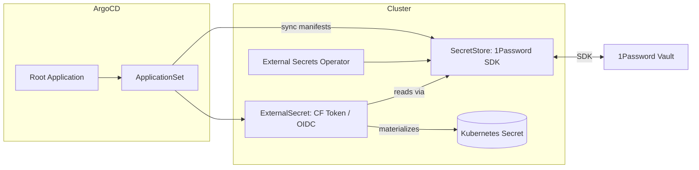

# External Secrets Operator (ESO) — 1Password SDK

This installs ESO via Helm and wires a SecretStore for 1Password SDK. Secrets remain in 1Password; Kubernetes gets ephemeral Secrets generated by ESO.

Key pieces:

- Helm install via Terraform module `modules/external-secrets` into `external-secrets` namespace with CRDs.
- SecretStore `onepassword` (see `old/gitops/apps/externalsecrets/secretstore-1password-sdk.yaml`). Provide a service token via a Kubernetes Secret created out-of-band.
- ExternalSecret examples for Cloudflare, Argo CD OIDC, etc.

Mermaid overview:

Notes:

- Do not commit real tokens. Use CI or manual `kubectl create secret` to populate the service token.
- Prefer narrowly scoped vault access for least privilege.
