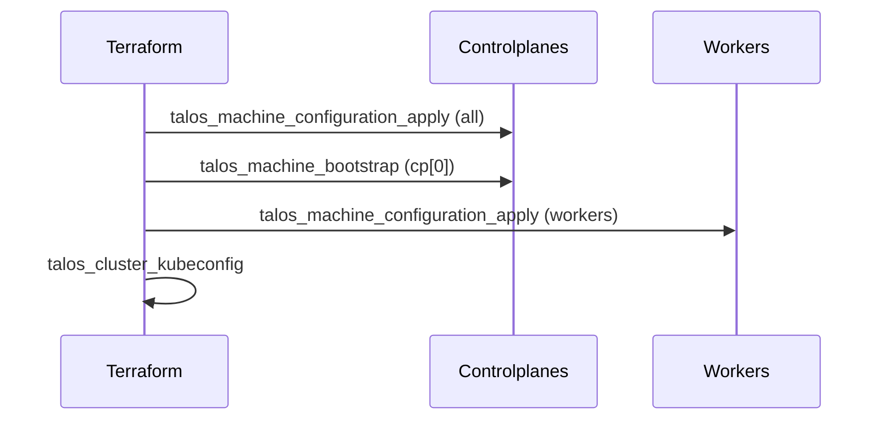

# Talos Cluster Module

Purpose: generate/apply Talos machine configs, bootstrap control-plane, and export kubeconfig for downstream Helm/Kubernetes providers.

Key choices:

- CNI set to none (install Cilium later)
- kube-proxy disabled (Cilium KPR)
- VIP 10.0.1.50 for API HA
- KubePrism enabled port 7445 on all nodes

Inputs (module `terraform/modules/talos-cluster`):

- cluster_name (string)
- cluster_vip (string IPv4)
- controlplane_ips (list(string))
- worker_ips (list(string), default [])
- talos_version (string, optional)
- install_disk (string, default /dev/sda)

Outputs:

- kubeconfig (sensitive)
- talos_client_configuration (sensitive)

Usage (excerpt from `terraform/envs/prod/main.tf`):

- module "talos" with VIP 10.0.1.50 and IPs from `proxmox_vms` module.

Design notes:

- A null_resource aggregates `talos_machine_configuration_apply.cp` so `talos_machine_bootstrap` can depend on a static address.
- Export kubeconfig via `talos_cluster_kubeconfig` resource (data source deprecated).
- Worker apply depends on bootstrap to ensure API is up before joins.

Mermaid (bootstrap flow):

Verification checklist:

- terraform init/validate passes
- No deprecated Talos data sources used
- VIP and KubePrism present in rendered configs
- kubeconfig output is sensitive and valid post-bootstrap
